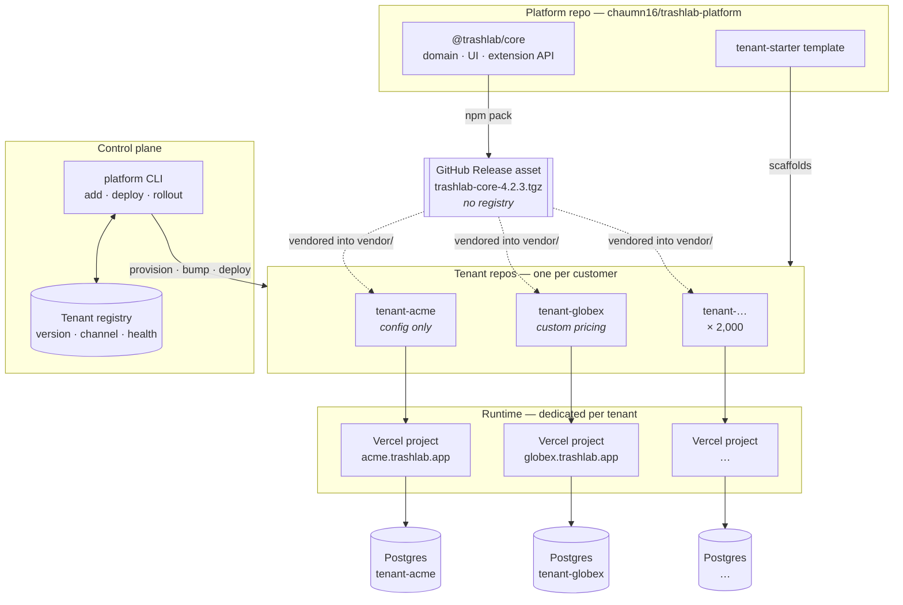
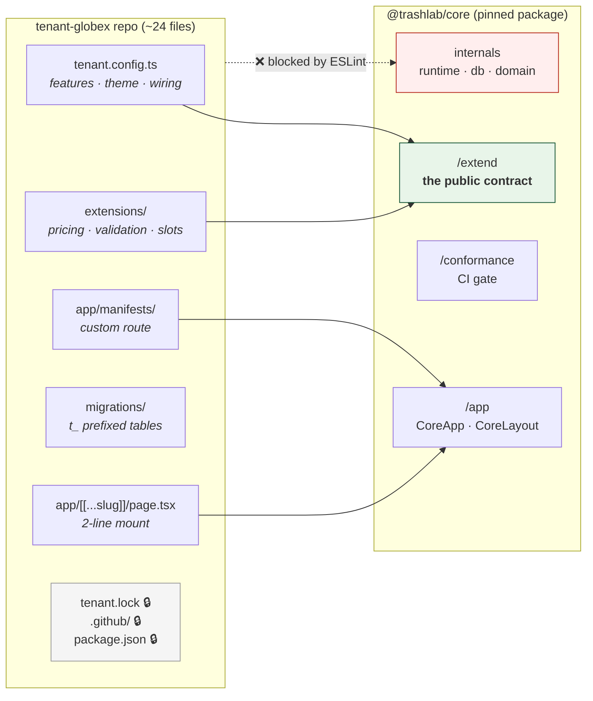
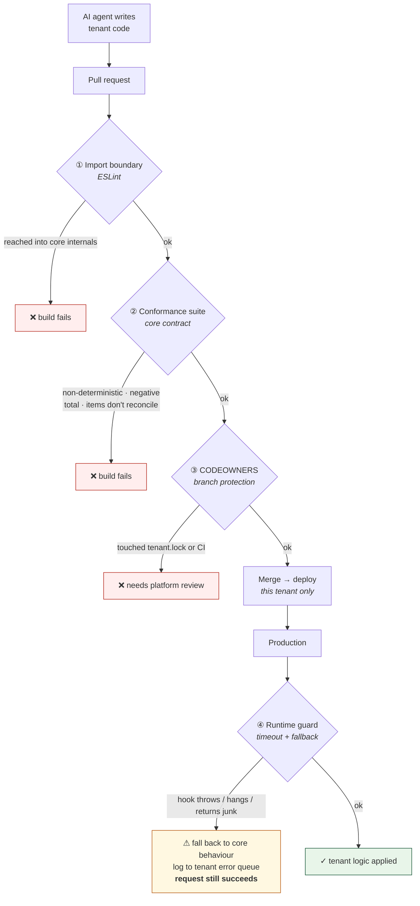
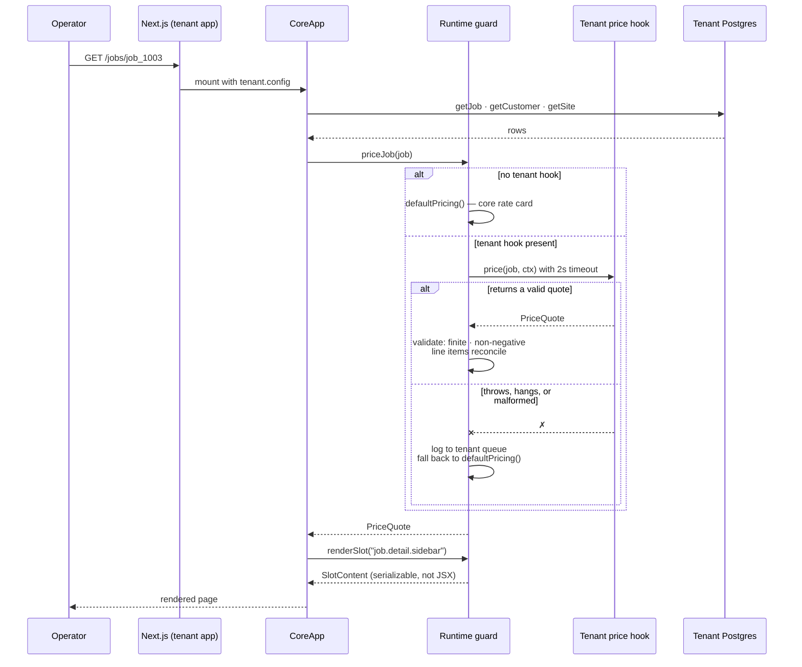
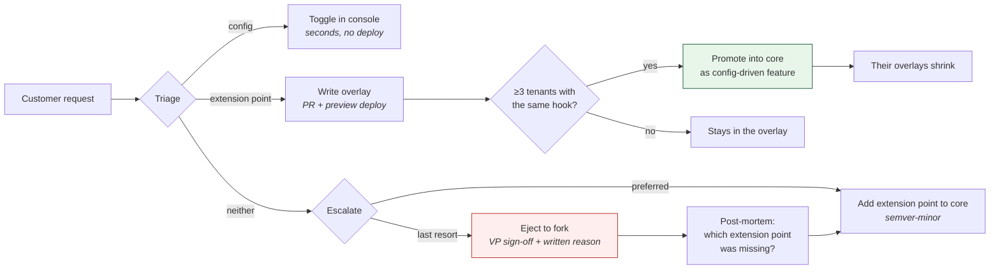
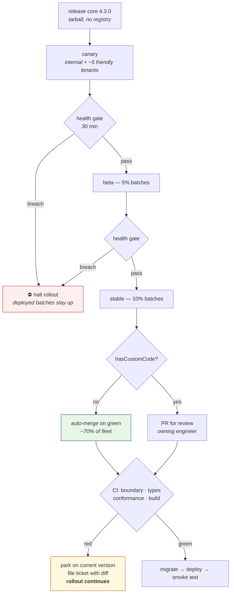
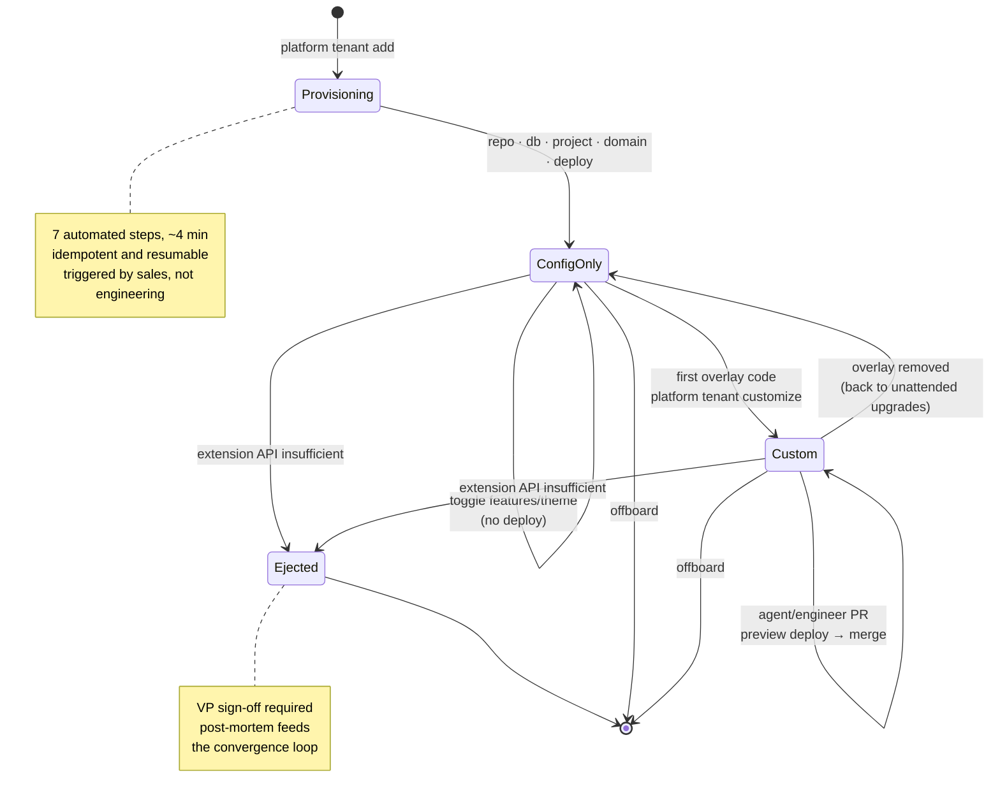

# Architecture

## The problem

Deploying one bespoke app is easy. The hard problem at ~2,000 tenants is **fleet
operations**: shipping a core security fix across 2,000 divergent deployments
without a three-week manual campaign, and knowing which forty of them broke.

Every decision here optimizes for that. The failure mode on one side is 2,000
forks. The failure mode on the other is "config flags only," which doesn't
deliver bespoke. This is the middle path.

---

## 1. System topology

One core package, consumed by many independent tenant repos, each deploying to
its own isolated runtime and database.

**Isolation comes from the connection string, not a `WHERE` clause.** Each Vercel
project holds only its own `DATABASE_URL`, so cross-tenant leakage is
structurally impossible rather than a code-review responsibility.

### Three layers, decided separately

| Layer | Choice | Why |
|---|---|---|
| **Code** | Shared core as a semver'd tarball, vendored per-tenant repo | One place to fix bugs; divergence contained in small reviewable surfaces; tenant repos need zero platform credentials |
| **Runtime** | Dedicated Vercel project per tenant | Blast radius, per-tenant rollback, required once core logic actually differs |
| **Data** | Dedicated Postgres per tenant | Tenants on different core versions can't share a schema |

---

## 2. What lives where

The whole app is core. A tenant repo is a thin shell that mounts it and injects
differences at named points.

🔒 = protected by `CODEOWNERS`. An agent working in a tenant repo can write
business logic freely but cannot change its own core version, edit CI, or reach
deploy secrets.

### Core owns invariants. Tenants own decisions.

| Core — never overridable | Tenant-owned |
|---|---|
| authn / authz, tenant identity | branding, theme |
| billing, audit log | custom fields and entities |
| data access layer, migration engine | business rules at named extension points |
| observability, version badge | custom pages and reports |
| API contracts, security controls | integrations, notification workflows |

---

## 3. The four enforcement layers

Convention doesn't survive 2,000 repos and AI-authored code. Each boundary is
mechanically enforced.

**Layers ② and ④ are deliberately different.** The runtime guard is the
production net and fails *soft* — a broken hook degrades to core behaviour rather
than 500ing. The conformance suite probes hooks *directly* so CI reports exactly
which rule broke; running CI through the guard would report every distinct bug as
the same opaque "invalid quote".

---

## 4. A priced request, end to end

Slots return a **serializable description, not JSX**, so core controls the markup.
An agent cannot inject arbitrary DOM or scripts into the admin shell.

---

## 5. Extension points

Defined in `packages/core/src/extend/types.ts`. That file is the entire surface
tenants may depend on. Adding to it is semver-minor; changing it is semver-major
and must ship with a codemod.

| Point | Contract |
|---|---|
| `hooks.price` | Deterministic, non-negative, must not throw; line items reconcile to total |
| `hooks.validateJob` | May **tighten** core validation, never loosen it |
| `hooks.onJobCompleted` / `onJobScheduled` | Fire-and-forget; errors swallowed to the tenant queue |
| `slots` | Named UI regions; return serializable content, not JSX |
| `customRoutes` | Ordinary Next.js routes; Next resolves them before core's catch-all |
| `customFields` | Tenant-declared fields, stored in the tenant's own database |

### The closed import boundary

Four public entry points, everything else internal:

| Allowed | Purpose |
|---|---|
| `@trashlab/core` | `CORE_VERSION`, `createStore` |
| `@trashlab/core/extend` | business logic — hooks, slots, types, money helpers |
| `@trashlab/core/app` | the mount — `CoreApp`, `CoreLayout` |
| `@trashlab/core/conformance` | the CI test harness |

Anything under `/dist`, `/src`, or any other subpath fails the build. Without
this, one agent reaching into core internals turns every core refactor into a
fleet-wide breaking change.

---

> The process around this — triage, gates, review, release, incident response —
> is documented in [SDLC.md](SDLC.md).

## 6. The convergence loop

The mechanism that stops 2,000 tenants becoming 2,000 codebases.

> When **three or more** tenants implement the same hook, promote it into core as
> a config-driven feature and shrink their overlays.

Tracked alongside **eject debt**. Platform health is measured by whether overlays
are *shrinking*, not by how many exist.

---

## 7. Versioning and rollout

- **The pin is the vendored tarball** — the exact bytes live in the tenant repo
  at `vendor/`, referenced by `package.json` as a `file:` dependency.
  Reproducible, credential-free, and rollback is a file swap.
- **The channel is a policy** — how fast the fleet controller may move that pin.

Tenants don't move pins; the controller does. A `pinned` tenant must carry an
**expiry date**, or you accumulate tenants on three-year-old core that nobody can
support.

**One tenant's failure never blocks the fleet.** A red CI run parks that tenant,
files a ticket, and the rollout continues. Stragglers are chased asynchronously.

**Config-only tenants auto-merge; custom-code tenants get a PR.** This split is
what keeps a 2,000-tenant rollout from needing 2,000 humans.

Migrations are **expand/contract**, always — a migration that makes the previous
build fail is a rollback you cannot perform. Details in
[`RUNBOOK-rollout.md`](RUNBOOK-rollout.md).

---

## 8. Tenant lifecycle

---

## 9. Known trade-offs

- **Repo-per-tenant makes fleet codemods harder than a monorepo.** Accepted
  deliberately: the repo boundary is what bounds an AI agent, and it buys
  per-tenant access control, deploy credentials, and audit trail. The cost is
  that fleet tooling is day-one infrastructure, not a later optimization.
- **2,000 repos means 2,000 CI runs per core release.** Mitigated by a hard
  2-second budget on the conformance suite, aggressive caching, and skipping
  repos whose pin didn't change. **Build concurrency on Vercel is the real
  ceiling** — it directly sets your CVE-patch SLA. Negotiate that number before
  the fleet passes ~400.
- **All tenants are dedicated today.** Cost is explicitly not a concern yet. The
  registry still carries `tier`, because pooling config-only tenants is the
  obvious lever when spend starts to matter — `hasCustomCode` already identifies
  the ~70% that could share a runtime.
- **The in-memory store is a demo affordance.**
  `packages/core/src/db/store.ts` marks the Postgres swap point.
