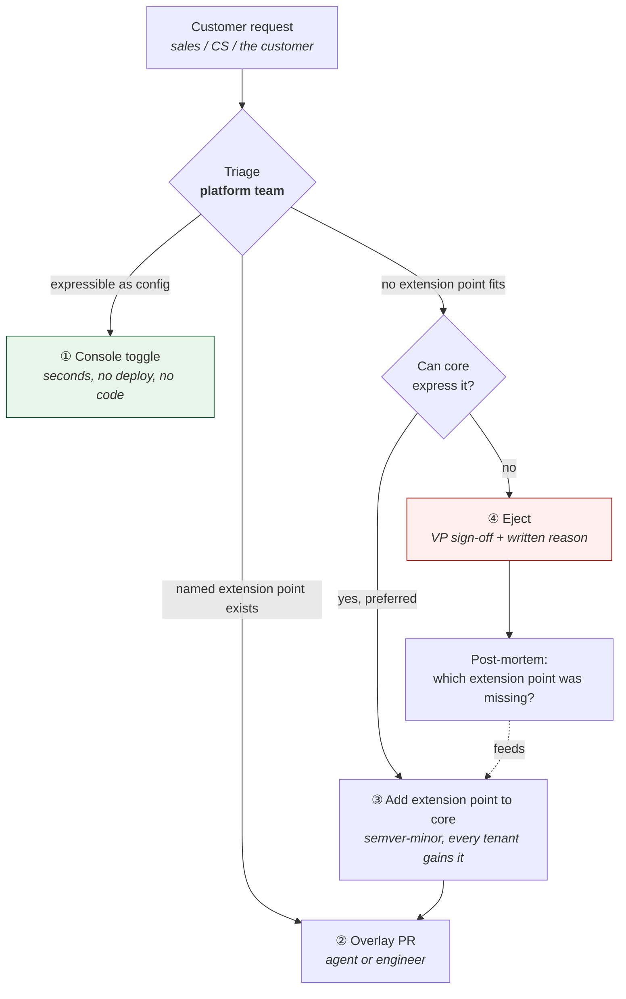
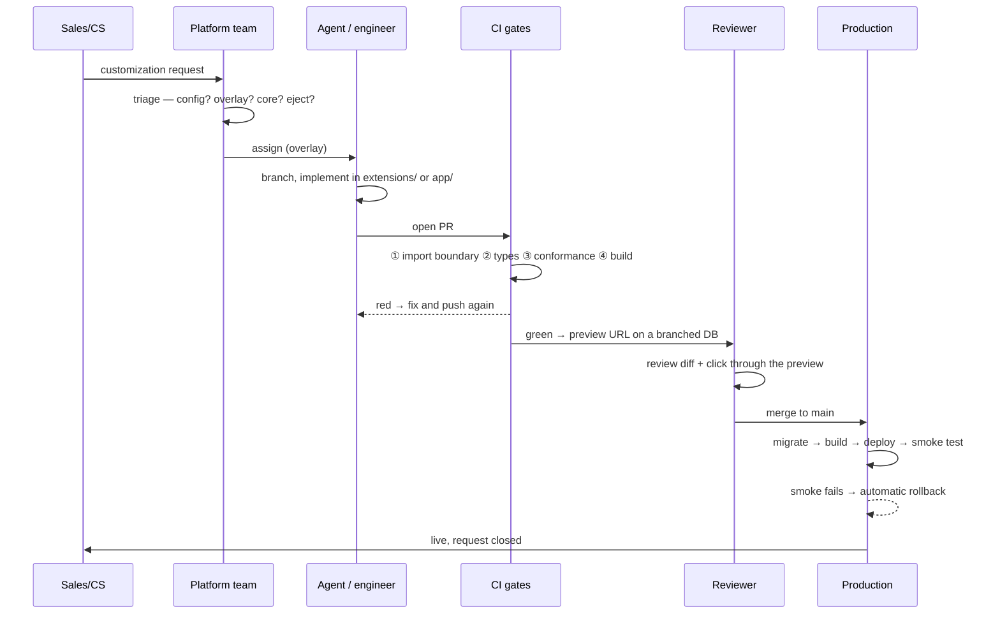

# Tenant SDLC

How software changes reach a customer, from request to production, and who is
accountable at each step.

This is written for a fleet where **most tenant code is written by AI agents**.
That single fact shapes every gate below: review capacity does not scale with
2,000 tenants, so correctness has to be enforced mechanically, and the blast
radius of a bad change has to be bounded by construction rather than by care.

Related: [ARCHITECTURE.md](ARCHITECTURE.md) for the model ·
[DEPLOY.md](DEPLOY.md) for the procedures · [RUNBOOK-rollout.md](RUNBOOK-rollout.md)
for fleet-wide core changes.

---

## 1. Four kinds of change

Almost every mistake in operating this platform is treating one of these as
another. Triage is the highest-leverage step in the whole lifecycle.

| # | Change | Where it lands | Who can do it | Deploy? | Blast radius |
|---|---|---|---|---|---|
| **1** | **Config** — feature flags, branding, custom field definitions | control plane | sales, CS | no | one tenant |
| **2** | **Overlay** — pricing, validation, slots, custom routes, tenant tables | tenant repo | agent, tenant engineer | that tenant only | one tenant |
| **3** | **Core** — new extension point, bug fix, rate card | platform repo | platform team | fleet rollout | **all 2,000** |
| **4** | **Ejection** — a fork | tenant repo | platform team + VP sign-off | that tenant only | one tenant, permanently |

**Escalate in that order and stop at the first one that works.** A config change
takes seconds and carries nothing forward. An overlay change is code this tenant
maintains across every future core upgrade. A core change is a fleet-wide risk.
An ejection is permanent.

---

## 2. Environments

| | Local | Preview | Production |
|---|---|---|---|
| **Runs on** | laptop | Vercel preview deployment | Vercel production project |
| **Trigger** | `npm run dev` | opening a PR | merge to `main` |
| **Data** | seeded in-memory store | branched copy of the tenant DB | the tenant's Postgres |
| **Core** | vendored tarball, or `link:core` | vendored tarball | vendored tarball |
| **Credentials** | none | scoped to that tenant | scoped to that tenant |
| **Audience** | whoever is building | reviewer, and the customer if you share it | the customer |

**There is no shared staging environment, by design.** With 2,000 tenants a
shared staging tier is either 2,000 more deployments to maintain or a lie about
what production looks like. Per-PR preview deployments against a branched
database do the job with a truer copy of the tenant's own data.

The gap this leaves: **no environment exercises cross-tenant behaviour**, because
there isn't any — tenants share no runtime and no database. That is a deliberate
property of the architecture, not an untested area.

---

## 3. Roles

| Role | Owns | Cannot |
|---|---|---|
| **Sales** | creating tenants, submitting customization requests | change code, change a tenant's core version |
| **CS / Support** | triaging requests, reading fleet health | merge, deploy |
| **AI agent** | overlay code inside one tenant repo | touch `tenant.lock`, `.github/`, `package.json`, `vendor/`, or any other tenant |
| **Tenant engineer** | the same surface, plus reviewing the agent's PRs | approve their own protected-path changes |
| **Platform team** | core, the extension contract, protected paths, fleet rollouts | (is the escalation point for everything else) |
| **Fleet controller** (automation) | moving core versions in batches, health gates, parking failures | bypass CI |

The agent's permissions are enforced by `CODEOWNERS` plus branch protection, not
by instructions in a prompt. An agent asked nicely not to edit CI would
eventually edit CI.

---

## 4. The lifecycle of an overlay change

The common case — change #2 above.

### Stages

**Intake.** A customization request is a first-class object in the console with
an owner and an SLA — not a Slack message. Requests that arrive as Slack messages
get logged before work starts, or the audit trail has a hole in it.

**Triage** (platform team). Classify against the table in §1. Record *why* it
isn't a config change if it isn't — that reasoning is what later tells you which
extension point is missing.

**Branch.** Short-lived, off `main`, in the tenant's own repo. Trunk-based; no
long-running release branches. Fleet-controller branches are named
`fleet/core-<version>` so they are filterable.

**Implement.** Local dev against the seeded store (see
[README](../README.md#run-everything-locally)). Agents and engineers work the
same surface and pass the same gates.

**CI gates** — every PR, in this order, cheapest failure first:

| Gate | Catches | Budget |
|---|---|---|
| ① Import boundary (ESLint) | reaching past `@trashlab/core/extend` into internals | seconds |
| ② Types (`tsc --noEmit`) | contract drift against the extension API | seconds |
| ③ Conformance (`@trashlab/core/conformance`) | non-determinism, negative totals, line items that don't reconcile, loosened core invariants | **< 2s, hard budget** |
| ④ Build (`next build`) | everything else | ~1 min |

The conformance budget is not a style preference. It runs ~2,000 times per core
release and its duration is a direct multiplier on how fast a CVE can be patched
across the fleet.

**Review.** A human reads the diff and clicks through the preview. What review is
*for* here is judgment the gates can't encode — is this pricing rule what the
customer actually asked for? Correctness against the contract is already
mechanically established by the time a reviewer looks.

**Merge → deploy.** Migrate, build, deploy, smoke-test `/`, `/jobs`,
`/customers`. Any non-200 rolls back automatically. Only that tenant is touched.

**Verify and close.** Confirm on the live site, close the request, notify the
requester.

### Definition of done

- [ ] All four CI gates green
- [ ] Preview deployment exercised by a human
- [ ] Deployed to production and smoke test passed
- [ ] Customization request closed with the outcome recorded
- [ ] If this was the tenant's first overlay code: `platform tenant customize <slug> --apply`
- [ ] If ≥3 tenants now carry a similar hook: filed to promote it into core (§7)

---

## 5. Testing

| Layer | What it proves | Where it runs |
|---|---|---|
| **Conformance suite** | tenant code satisfies the core contract | every PR, every core bump |
| **Tenant's own tests** | this tenant's business rules are right | every PR |
| **Type check** | the overlay matches the extension API | every PR |
| **Build** | it compiles and renders | every PR |
| **Preview deployment** | it behaves, against realistic data | every PR, by a human |
| **Post-deploy smoke test** | the deployed thing actually serves | every deploy |
| **Fleet health gates** | a core release is safe to widen | every rollout batch |

The conformance suite is the load-bearing one. It is what makes agent-authored
code mergeable at all: an agent can write whatever it likes inside `extensions/`,
but it cannot ship a pricing hook that reads the clock, returns fractional cents,
or produces line items that don't sum to the total.

**Known gaps, stated plainly:** there is no end-to-end browser test suite, no
load testing, and no automated accessibility check. The smoke test verifies that
pages return 200, not that they are correct.

---

## 6. Versioning and release

**A tenant app has no version number of its own.** Its identity is
`core version + git SHA`, both visible in the app's header badge and reported to
the control plane on every deploy. That is deliberate: a tenant-specific semver
would imply a compatibility contract that nothing consumes.

| | Cadence | Mechanism |
|---|---|---|
| Overlay change | continuous | merge to `main` → deploy that tenant |
| Config change | immediate | console toggle, no deploy |
| Core change | on the rollout train | canary → beta → stable, batched with health gates |
| Security patch | immediate, fleet-wide | force path, bypasses tenant review |

Core reaches a tenant by the fleet controller swapping the vendored tarball in
`vendor/`, repointing `package.json`, and updating `tenant.lock` — in one commit,
so `git log` on a tenant repo is an honest record of which bytes ran when.

**Rollback** is per-tenant and immediate: `vercel rollback`, or re-vendor the
previous tarball. Safe because core migrations are expand/contract, so the
previous build stays compatible with the migrated schema.

---

## 7. Inherited change: core upgrades

A tenant receives changes it did not ask for. That path has its own lifecycle,
and it is the one that decides whether this model survives contact with 2,000
tenants.

The split that makes it tractable:

- **Config-only tenants** (no `extensions/`): the bump PR **auto-merges on
  green**. No human involved.
- **Tenants carrying custom code** (`hasCustomCode: true`): the bump opens a
  **PR for review** by the owning engineer.

A red CI run **parks that tenant** on its current version and files a ticket. It
never blocks the rollout; stragglers are chased asynchronously. Full procedure in
[RUNBOOK-rollout.md](RUNBOOK-rollout.md).

### The convergence loop

The feedback mechanism that keeps 2,000 tenants from becoming 2,000 codebases:

> When **three or more** tenants implement the same hook, promote it into core as
> a config-driven feature and shrink their overlays.

Reviewed monthly alongside **eject debt**. Platform health is measured by whether
overlays are *shrinking*, not by how many exist. A quarter where every tenant's
overlay grew is a quarter where the extension API is failing, regardless of how
many tickets closed.

---

## 8. Observability and incident response

Every deploy is tagged with `tenantId` and `coreVersion`, so dashboards slice by
version. The question you need answered during a rollout is "is 4.3.0 bad on
three tenants", not "are errors up".

**Errors originating in tenant overlay code route to that tenant's queue, not to
core on-call.** One customer's bad pricing hook must never page the platform
team — and at runtime it doesn't even degrade the page, because the guard in
`packages/core/src/domain/runtime.ts` falls back to core behaviour.

| Scope | Signal | Owner | First action |
|---|---|---|---|
| One tenant | smoke test fails, 5xx on one domain | tenant's owning engineer | `vercel rollback` |
| One core version | health gate breach during a rollout | platform team | halt rollout (deployed batches stay up) |
| Fleet | CVE, or a bad version already at stable | platform team | force path: patch, bypass review, fleet-wide |

**Halting a rollout is not rolling one back.** Already-deployed batches keep
running; you stop widening. Deciding which of the two you need is the first call
in any rollout incident.

---

## 9. Decommissioning

**Not yet implemented.** Documented here so it isn't discovered during a
cancellation.

What a complete offboarding has to cover:

1. Export the customer's data in a portable format, on request — contractual in
   most enterprise agreements.
2. Disable the production deployment; keep the domain resolving to a notice page
   for an agreed window.
3. Retain the database for the contractual period, then destroy it and record
   that it was destroyed.
4. Archive the tenant repo (read-only, not deleted — it is the audit trail).
5. Mark the tenant `offboarded` in the registry so it leaves fleet rollouts and
   drift reports without vanishing from history.
6. Release the subdomain only after the retention window, and never re-issue a
   slug to a different customer.

Steps 1, 3, and 6 have legal consequences and should be specified with whoever
owns your customer agreements before the first cancellation, not after.

---

## 10. Audit trail

Where each question is answered, without asking anyone:

| Question | Source |
|---|---|
| What code is running for this tenant right now? | tenant repo `main` + `tenant.lock` |
| Which core version, and since when? | `git log` on the tenant repo — the tarball swap commit |
| Who approved this change? | PR review record, CODEOWNERS-enforced |
| Who onboarded this customer? | provisioning workflow run in Actions |
| Why does this tenant have custom pricing? | the customization request, linked from the PR |
| Was this tenant affected by the 4.3.0 rollout? | fleet controller run + control-plane deploy events |
| What did we promise and when? | customization request record |

The gap worth closing early: the console currently records `requestedBy:
"console"` because there is no identity to read yet. Once SSO is in front of the
control plane, pass the authenticated user through — provisioning a customer
should never be anonymous.
